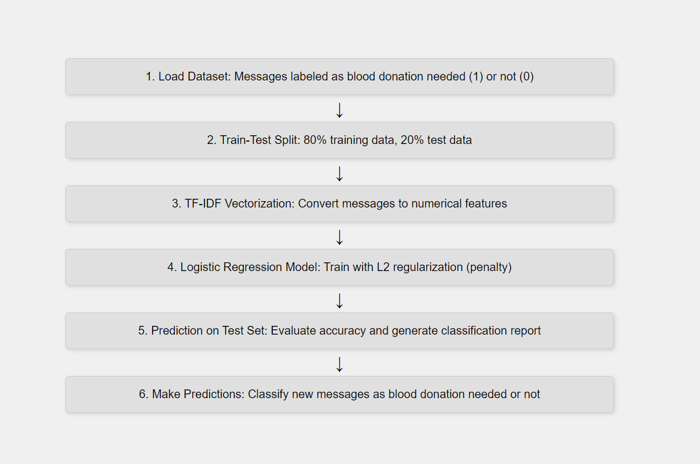

# Introduction
The dataset comprises messages in Bengali, English, and Banglish (a mix of Bengali and English). Handling these languages effectively is critical since emergency blood donation requests in Bangladesh are often communicated using all three.

# Data Preparation

The dataset was constructed to address imbalances and linguistic diversity. The data collection included both positive samples (blood donation needed) and negative samples (non-relevant messages), generated and labeled carefully. 

Each message was labeled:

* 1: Blood donation needed.
* 0: Not related to blood donation.

Below is a detailed breakdown of the data preparation process.

### Bengali Data Preparation

- Positive Samples:

We parsed 702 positive samples, most of which are written in Bengali. These samples contain blood group information, patient status, location, and contact numbers.

- Negative Samples:

400 Bengali negative samples were generated with frequent blood-related keywords embedded, such as "রক্ত," "হাসপাতাল," and "ব্যাগ," to ensure the model is exposed to potential confusions.
To avoid limiting the vocabulary, 200 additional diverse Bengali negative samples were created to cover a wide range of topics beyond emergency contexts.

### English Data Preparation

To ensure the model can handle English messages effectively, we generated equal numbers of positive and negative samples. Below is the approach used:

- Positive Samples (400):

Examples include requests for specific blood groups, with details such as hospital names, patient conditions, and contact numbers.
These samples vary in structure and phrasing to avoid overfitting to patterns.

- Negative Samples (400):

These samples cover a broad range of non-relevant topics, such as travel plans, sports, events, and daily activities, to simulate real-world message variance.

### Code to generate English Dataset

```python

import pandas as pd
import random

positive_samples = [ ''' Positive blood donation messages...''' ]
negative_samples = [ ''' Non-relevant messages...''' ]

def generate_samples(samples, n):
    generated_samples = []
    for _ in range(n):
        sample = random.choice(samples) + random.choice(["!", ".", ""])
        generated_samples.append(sample)
    return generated_samples

num_samples = 400
positive_samples_final = generate_samples(positive_samples, num_samples)
negative_samples_final = generate_samples(negative_samples, num_samples)

data = {"message": positive_samples_final + negative_samples_final, "label": [1] * num_samples + [0] * num_samples}
df = pd.DataFrame(data)
df.to_csv("./english_dataset.csv", index=False)
```

### Banglish Data Preparation

Messages written in Banglish (Bengali transliterated into English) are common in communication channels in Bangladesh. We generated 200 positive and 200 negative Banglish samples to ensure the model can handle this mixed-language input effectively.

- Positive Samples (200):

These samples follow typical blood donation requests but use a mix of English and transliterated Bengali words, such as "dorkar," "contact," and "lagbe."
- Negative Samples (200):

Negative samples cover diverse, non-relevant conversations, such as casual chats, daily activities, and announcements, using Banglish.

### Code to Generate Banglish Dataset:

```python
positive_samples_banglish = [ ''' Positive Banglish samples...''' ]
negative_samples_banglish = [ ''' Non-relevant Banglish messages...''' ]

def generate_samples(samples, n):
    generated_samples = []
    for _ in range(n):
        sample = random.choice(samples) + random.choice(["", "!", "."])
        generated_samples.append(sample)
    return generated_samples

num_samples = 200
positive_samples_final = generate_samples(positive_samples_banglish, num_samples)
negative_samples_final = generate_samples(negative_samples_banglish, num_samples)

data = {"message": positive_samples_final + negative_samples_final, "label": [1] * num_samples + [0] * num_samples}
df = pd.DataFrame(data)
df.to_csv("./banglish_dataset.csv", index=False)
```

#  Logistic Regression Model

### Model Overview

We first experimented with Logistic Regression using TF-IDF vectorization. This approach transforms text messages into numerical features by capturing the frequency of unigrams and bigrams. We used L2 regularization to prevent overfitting.

### Model Diagram



### Model Implementation

```python
import pandas as pd
from sklearn.model_selection import train_test_split
from sklearn.feature_extraction.text import TfidfVectorizer
from sklearn.linear_model import LogisticRegression
from sklearn.metrics import classification_report, accuracy_score
from sklearn.utils import shuffle

# Load and shuffle the dataset
df = pd.read_csv('./data-preprocessing/dataset.csv')
df = shuffle(df, random_state=42)

X = df['message']  # Features
y = df['label']    # Labels

# Train-test split
X_train, X_test, y_train, y_test = train_test_split(X, y, test_size=0.2, random_state=42)

# TF-IDF Vectorization
tfidf = TfidfVectorizer(max_features=5000, ngram_range=(1, 2))
X_train_tfidf = tfidf.fit_transform(X_train)
X_test_tfidf = tfidf.transform(X_test)

# Logistic Regression with L2 regularization
model = LogisticRegression(C=1.0, penalty='l2', solver='lbfgs', max_iter=10000)
model.fit(X_train_tfidf, y_train)

# Predict and evaluate
y_pred = model.predict(X_test_tfidf)
accuracy = accuracy_score(y_test, y_pred)

print(f'Accuracy: {accuracy}')
print(f'Classification Report:\n {classification_report(y_test, y_pred)}')


```

### Sample Evaluation Output


```python

Test Accuracy: 0.987

               precision    recall  f1-score   support

           0       0.99      0.99      0.99       249
           1       0.99      0.99      0.99       276

    accuracy                           0.99       525
   macro avg       0.99      0.99      0.99       525
weighted avg       0.99      0.99      0.99       525


```

- Custom Message Prediction

Message: " Keu ektu shahajjo koren, amar fupir jonno birdem hospital e A-ve rokto proyojon"
prediction: 1

Message: "Emergency"
prediction: 1

Message: "আমি ভালোবাসি ব্যাগ,ইমারজেন্সি"
prediction: 0

### Key Observations from Logistic Regression

- Accuracy: The model achieved 99% accuracy on test set, showing its ability to distinguish between blood donation messages and unrelated messages.

- Overfitting Issues: The model showed bias towards certain words that are frequently used in positive samples (e.g., "bag," "emergency", "রক্ত") leading to incorrect classification.

# FastText Classifier Model

### Model Overview
This documentation presents the Blood Donation Needed Message Classifier using the FastText algorithm. The objective is to accurately detect messages requesting blood donation from text inputs in Bengali, English, and Banglish (mixed Bengali and English). The model is evaluated and compared with a Logistic Regression model to ensure robustness, with FastText emerging as the preferred approach due to its superior handling of multilingual and mixed-language texts.


### Model Architecture

FastText is a text classification algorithm developed by Facebook AI Research. It offers several advantages:

- Subword embeddings: This improves the handling of words with misspellings or morphological variations (e.g., "roktodan" vs. "blood donation").
- Support for n-grams: FastText captures word sequences for improved context.
- Speed and Scalability: The algorithm is fast to train and efficient for large datasets.


### Model Diagram


### Model Implementation

```python

import fasttext

# Train a FastText model
model = fasttext.train_supervised(input="dataset.txt", epoch=25, lr=1.0, wordNgrams=2)

# Save the model
model.save_model("blood_donation_model.bin")

# Load the saved model
model = fasttext.load_model("blood_donation_model.bin")

# Predict new messages
messages = [
    "Urgent blood needed at Dhaka Medical.",
    "Amar bag harie geche, help korte parben?",
    "Keu ektu rokto donate korte paren?",
    "Enjoying coffee at the café."
]

for message in messages:
    prediction = model.predict(message)
    label, confidence = prediction[0][0], prediction[1][0]
    print(f"Message: '{message}' | Prediction: {label} | Confidence: {confidence}")


```

### Key Parameters Used in FastText

- epoch=1000: The model was trained for 1000 epochs to ensure thorough learning.
- wordNgrams=3: Trigrams were used to capture better context from consecutive word sequences.
- minn=3, maxn=6: Subword length configuration to handle out-of-vocabulary words.
- lr=1.0: Learning rate for gradient updates.

### Model Evaluation

The FastText model was evaluated using the test set. The evaluation metrics included accuracy, precision, recall, and F1-score. 

- Sample Evaluation Output:

```python

Test Accuracy: 0.987

Classification Report:

               precision    recall  f1-score   support

           0       0.99      0.99      0.99       249
           1       0.99      0.98      0.99       276

    accuracy                           0.99       525
   macro avg       0.99      0.99      0.99       525
weighted avg       0.99      0.99      0.99       525


```

- Custom Message Prediction

```python
Message: 'হ্যা লো বন্ধুরা, এখন আমরা মডেলটিকে টেস্ট করব। চলো দেখি' 
Prediction: __label__0 | Confidence: 0.995

Message: 'ektu test kore dekhi kemon lage' 
Prediction: __label__0 | Confidence: 0.989

Message : 'Urgent O+ve blood needed at Dhanmondi City Hospital, Contact 01******* 
Prediction: __label__1 | Confidence: 0.979

```
